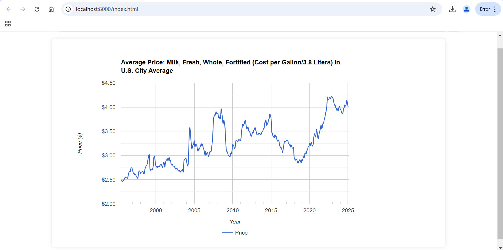

# Milk Price Visualization

This project visualizes the average price of milk in U.S. cities over time using Google Charts.

## Screenshot

## Data Source
The visualization uses data from the Federal Reserve Bank of St. Louis Economic Data (FRED):
- Series ID: APU000709112
- Title: Average Price: Milk, Fresh, Whole, Fortified (Cost per Gallon/3.8 Liters) in U.S. City Average

## Features
- Interactive line chart showing price trends from 2000 to 2025
- Currency formatting for price axis
- Year formatting for time axis
- Smooth curve transitions
- Interactive tooltips
- Responsive design

## Setup
1. Make sure you have Python installed
2. Run the local server: `python server.py`
3. Open in browser: http://localhost:8000/index.html

## Files
- `index.html` - Contains the Google Charts implementation
- `server.py` - Local server for viewing the chart
- `APU0000709112.csv` - Data file containing milk price history
- `milk_price_chart.png` - Screenshot of the visualization 